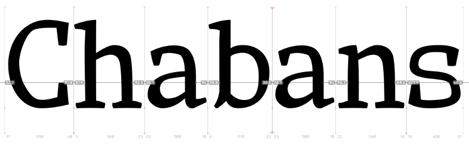

<h1 align="center">
  
</h1>

Introducing "Chabans", an exquisite open source font face project that combines
timeless elegance with modern simplicity. Created with meticulous attention to
detail, this project offers a refined collection of typefaces that are both
versatile and distinctive.

With its clean lines, elegant curves, and precise geometry, Chabans is a font
face that combines classic design principles with modern sensibilities. Its
unique blend of traditional and contemporary elements make it a versatile choice
for a wide range of design applications.

And because Chabans is open source, it's accessible to anyone who wants to use
it for their own projects. Whether you're a professional designer or a hobbyist,
you'll have access to this incredible font face without any licensing fees or
restrictions.
